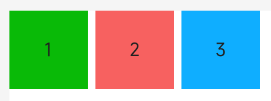

# div

## 概述

基础容器，用作页面结构的根节点或将内容进行分组。

## 子组件

支持

## 属性

支持[通用属性](../general/properties.md)

## 样式

支持[通用样式](../general/style.md)

## 事件

支持[通用事件](../general/events.md)

## 示例代码
```html
<template>
 <div class="page">
 <div style="flex-direction: row;">
 <text class="item color-1">1</text>
 <text class="item color-2">2</text>
 <text class="item color-3">3</text>
 </div>
 </div>
</template>
<style>
 .page {
 margin: 20px;
 flex-direction: column;
 background-color: white;
 }

 .item {
 height: 100px;
 width: 100px;
 text-align: center;
 margin-right: 10px;
 }
 
 .color-1 {
 background-color: #09ba07;
 }
 
 .color-2 {
 background-color: #f76160;
 }
 
 .color-3 {
 background-color: #0faeff;
 }
</style>
``` 


