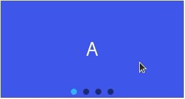

# swiper

## 概述

滑块视图容器。

## 子组件

支持

## 属性

支持[通用属性](../general/properties.md)

名称 | 类型 | 默认值 | 必填 | 描述 
---|:---:|---|:---:|--- 
index | `&lt;number&gt;` | ０ | 否 | 当前显示的子组件索引 
autoplay | `&lt;boolean&gt;` | false | 否 | 渲染完成后，是否自动进行播放 
interval | `&lt;number&gt;` | 3000ms | 否 | 自动播放时的时间间隔，单位毫秒 
indicator | `&lt;boolean&gt;` | true | 否 | 是否启用 indicator，默认 true 
loop | `&lt;boolean&gt;` | true | 否 | 是否开启循环模式 
duration | `&lt;number&gt;` |:---:| 否 | 滑动动画时长（duration默认根据手指的速度动态计算） 
vertical | `&lt;boolean&gt;` | false | 否 | 滑动方向是否为纵向，纵向时indicator 也为纵向 
previousmargin | `&lt;string&gt;` | 0px | 否 | 前边距，可用于露出前一项的一小部分，支持单位：px和% 
nextmargin | `&lt;string&gt;` | 0px | 否 | 后边距，可用于露出后一项的一小部分，支持单位：px和% 
enableswipe | `&lt;boolean&gt;` | true | 否 | 是否支持手势滑动swiper 
 
**备注** ：`previousmargin`和`nextmargin`的总和不应该超过整个swiper大小的1/2，超过部分将会被截取。

## 样式

支持[通用样式](../general/style.md)

名称 | 类型 | 默认值 | 必填 | 描述 
---|:---:|---|:---:|--- 
indicator-color | `&lt;color&gt;` | rgba(0, 0, 0, 0.5) | 否 | indicator 填充颜色 
indicator-selected-color | `&lt;color&gt;` | #33b4ff 或者 rgb(51, 180, 255) | 否 | indicator 选中时的颜色 
indicator-size | `&lt;length&gt;` | 20px | 否 | indicator 组件的直径大小 
indicator-[top|left|right|bottom] | `&lt;length&gt;` | `&lt;percentage&gt;` |:---:| 否 | indicator相对于swiper的位置 
 
## 事件

支持[通用事件](../general/events.md)

名称 | 参数 | 描述 
---|:---:|--- 
change | &#123;index:currentIndex&#125; | 当前显示的组件索引变化时触发 
swipestart[2+](../../guide/version/APILevel2.md) | &#123;index:currentIndex&#125; | 子组件切换动画开始时触发（如果是手指拖动导致的切换，指的是手指按压开始拖动的时间点） 
swipeend[2+](../../guide/version/APILevel2.md) | &#123;index:currentIndex&#125; | 子组件切换动画结束时触发 
 
## 方法

名称 | 参数 | 描述 
---|:---:|--- 
swipeTo | &#123;index: number(指定位置)&#125; | swiper 滚动到 index 位置 
 
## 示例代码
```html
<template>
 <div class="page">
 <swiper class="swiper">
 <text class="item item-1">A</text>
 <text class="item item-2">B</text>
 <text class="item item-3">C</text>
 <text class="item item-4">D</text>
 </swiper>
 
 </div>
</template>

<style>
 .page {
 padding: 30px;
 background-color: white;
 }

 .swiper {
 width: 300px;
 height: 160px;
 indicator-size: 10px;
 }

 .item {
 text-align: center;
 color: white;
 font-size: 30px;
 }

 .item-1 {
 background-color: #3f56ea;
 }

 .item-2 {
 background-color: #00bfc9;
 }

 .item-3 {
 background-color: #47cc47;
 }

 .item-4 {
 background-color: #FF6A00;
 }
</style>
``` 


