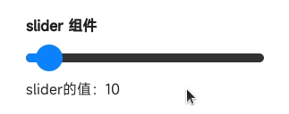

# slider

## 概述

滑动选择器

## 子组件

不支持

## 属性

支持[通用属性](../general/properties.md)

名称 | 类型 | 默认值 | 必填 | 描述 
---|:---:|---|:---:|--- 
min | `&lt;number&gt;` | ０ | 否 | - 
max | `&lt;number&gt;` | 100 | 否 | - 
step | `&lt;number&gt;` | 1 | 否 | - 
value | `&lt;number&gt;` | 0 | 否 | - 
 
## 样式

支持[通用样式](../general/style.md)

名称 | 类型 | 默认值 | 必填 | 描述 
---|:---:|---|:---:|--- 
color | `&lt;color&gt;` | #f0f0f0 或者 rgb(240, 240, 240) | 否 | 背景条颜色 
selected-color | `&lt;color&gt;` | #009688 或者 rgb(0, 150, 136) | 否 | 已选择颜色 
block-color | `&lt;color&gt;` |:---:| 否 | 滑块的颜色 
padding-[left|right] | `&lt;length&gt;` | 32px | 否 | 左右边距 
 
## 事件

支持[通用事件](../general/events.md)

名称 | 参数 | 描述 
---|:---:|--- 
change | &#123;progress:progressValue, isFromUser:isFromUserValue&#125; | 完成一次拖动后触发的事件 
isFromUser说明： 
该事件是否由于用户拖动触发 
 
## 示例代码
```html
<template>
 <div class="page">
 <text class="title">slider 组件</text>
 <slider class="slider" min="0" max="100" step="10" value="{{ initialSliderValue }}" onchange="onSliderChange"></slider>
 <text>slider的值：{{ sliderValue }}</text>
 </div>
</template>

<script>
 export default {
 private: {
 initialSliderValue: 10,
 sliderValue: null
 },
 onSliderChange (e) {
 this.sliderValue = e.progress
 }
 }
</script>

<style>
 .page {
 flex-direction: column;
 padding: 30px;
 background-color: #ffffff;
 }

 .title {
 font-weight: bold;
 }

 .slider {
 margin-top: 20px;
 margin-bottom: 20px;
 padding-left: 0;
 padding-right: 0;
 }
</style>
``` 


