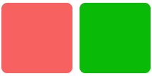

# 通用样式

通用样式，即所有组件都可以支持的样式。

它们均与 css 的属性样式用法保持一致，开发者可写在`内联样式`或`&lt;style&gt;`标签里，实现组件样式的定制化。

关于组件样式的设置，可以参考此[文档](../../guide/framework/style/page-style-and-layout.md)。

## 示例代码
```html
<template>
 <div class="page">
 <div class="box-normal" style="background-color:#f76160"></div>
 <div class="box-normal"></div>
 </div>
</template>

<style>
 .page {
 padding: 30px;
 background-color: white;
 }

 .box-normal {
 background-color: #09ba07;
 width: 100px;
 height: 100px;
 border-radius: 8px;
 margin-right: 10px;
 }
</style>
``` 



## 属性列表

**注** ：通用样式均为非必填项。

名称 | 类型 | 默认值 | 描述 
---|:---:|---|--- 
width | `&lt;length&gt;` | `&lt;percentage&gt;` |:---:| 未设置时使用组件自身内容需要的宽度 
height | `&lt;length&gt;` | `&lt;percentage&gt;` |:---:| 未设置时使用组件自身内容需要的高度 
min-width | auto | `&lt;length&gt;` | `&lt;percentage&gt;` | auto | 指定元素的最小宽度。该属性不能为负值，默认值 `auto` 为弹性元素的默认最小宽度，下同 
min-height | auto | `&lt;length&gt;` | `&lt;percentage&gt;` | auto | 指定元素的最小高度 
max-width | none | `&lt;length&gt;` | `&lt;percentage&gt;` | none | 指定元素的最大宽度。该属性不能为负值，默认值 `none` 表示不做限制，下同 
max-height | none | `&lt;length&gt;` | `&lt;percentage&gt;` | none | 指定元素的最大高度 
padding | `&lt;length&gt;` | 0 | 简写属性，在一个声明中设置所有的内边距属性，该属性可以有 1 到 4 个值，具体请参考[MDN (opens new window)](https://developer.mozilla.org/zh-CN/docs/Web/CSS/padding)文档 
padding-[left|top|right|bottom] | `&lt;length&gt;` | 0 | 设置一个元素的某个方向的内边距，padding 区域指一个元素的内容和其边界之间的空间，该属性不能为负值 
margin | `&lt;length&gt;` | 0 | 简写属性，在一个声明中设置所有的外边距属性，该属性可以有 1 到 4 个值，具体请参考[MDN (opens new window)](https://developer.mozilla.org/zh-CN/docs/Web/CSS/margin)文档 
margin-[left|top|right|bottom] | `&lt;length&gt;` | 0 | 设置一个元素的某个方向的外边距，该属性不能为负值 
border |:---:| 0 | 简写属性，在一个声明中设置所有的边框属性，可以按顺序设置属性 width style color，不设置的值为默认值 
border-style | solid | solid | 暂时仅支持 1 个值，为元素的所有边框设置样式 
border-width | `&lt;length&gt;` | 0 | 设置元素的所有边框宽度 
border-color | `&lt;color&gt;` | black | 设置元素的所有边框颜色，颜色值的填入请参考 [颜色配置](color.md) 
border-radius | `&lt;length&gt;` | `&lt;percentage&gt;` | 0 | border-radius 属性允许你设置元素的外边框圆角。设置时需要同时设置 border-width、border-color。radius 的幅度不会超过矩形较短边的一半 
background-color | `&lt;color&gt;` |:---:| 颜色值的填入请参考 [颜色配置](color.md) 
color | `&lt;color&gt;` |:---:| 颜色值的填入请参考 [颜色配置](color.md) 
background-image | `&lt;uri&gt;` |:---:| 支持本地图片资源与网络图片资源；使用`internal://`协议图片需将aiot-toolkit升级到1.1.2以上版本 
background-size | contain | cover | auto | `&lt;length&gt;` | `&lt;percentage&gt;` | auto auto | 设置背景图片大小，详情见[背景图样式](background-img-styles.md) 
background-repeat | repeat | repeat-x | repeat-y | no-repeat | repeat | [暂不支持] 设置是否及如何重复绘制背景图像，详情见[背景图样式](background-img-styles.md) 
background-position | `&lt;length&gt;` |`&lt;percentage&gt;`| left | right | top | bottom | center | 0px 0px | 设置背景图片在容器中绘制的位置，支持 1-4 个参数，详情见[背景图样式](background-img-styles.md) 
box-shadow [3+](../../guide/version/APILevel3.md) | `&lt;length&gt;` `&lt;length&gt;` `&lt;color&gt;` | 
`&lt;length&gt;` `&lt;length&gt;` `&lt;length&gt;` `&lt;color&gt;` | 
`&lt;length&gt;` `&lt;length&gt;` `&lt;length&gt;` `&lt;length&gt;` `&lt;color&gt;` 
|:---:| 设置元素的阴影效果，该属性可设置的值包括阴影的 X 轴偏移量、Y 轴偏移量、模糊半径、扩散半径和[颜色](color.md)。 
写法举例： 
box-shadow: 60px -16px teal，值分别对应：x轴偏移量、y轴偏移量、[阴影颜色](color.md)； 
box-shadow: 10px 5px 5px black，值分别对应：x轴偏移量、y轴偏移量、阴影模糊半径、[阴影颜色](color.md)； 
box-shadow: 2px 2px 2px 1px rgba(0, 0, 0, 0.2)，值分别对应：x轴偏移量、y轴偏移量、阴影模糊半径、阴影扩散半径、[阴影颜色](color.md) 
opacity | `&lt;number&gt;` | 1 | opacity 属性指定了一个元素的透明度 
display | flex | none | flex | JS 应用只支持 flex 布局；将当前元素的 display 设置为 none JS 应用页面将不渲染此元素 
visibility | visible | hidden | visible | visibility 属性控制显示或隐藏元素而不更改文档的布局 
flex | `&lt;number&gt;` |:---:| 父容器为`&lt;div&gt;、&lt;list-item&gt;`时生效 
flex-grow | `&lt;number&gt;` | 0 | 父容器为`&lt;div&gt;、&lt;list-item&gt;`时生效 
flex-shrink | `&lt;number&gt;` | 1 | 父容器为`&lt;div&gt;、&lt;list-item&gt;`时生效 
flex-basis | `&lt;number&gt;` | -1 | 父容器为`&lt;div&gt;、&lt;list-item&gt;`时生效 
flex-direction | `&lt;string&gt;` | row | 默认为横向`row`，父容器为`&lt;div&gt;、&lt;list-item&gt;`时生效 
align-items | `&lt;string&gt;` | flex-start | align-items 定义了伸缩项目可以在伸缩容器的当前行的侧轴上对齐方式。flex-start(默认值)：伸缩项目在侧轴起点边的外边距紧靠住该行在侧轴起始的边。flex-end：伸缩项目在侧轴终点边的外边距靠住该行在侧轴终点的边 。center：伸缩项目的外边距盒在该行的侧轴上居中放置。baseline：伸缩项目根据他们的基线对齐。stretch：伸缩项目拉伸填充整个伸缩容器。此值会使项目的外边距盒的尺寸在遵照「min/max-width/height」属性的限制下尽可能接近所在行的尺寸 
justify-content | `&lt;string&gt;` | flex-start | justify-content 定义了伸缩项目沿着主轴线的对齐方式。flex-start(默认值)：伸缩项目向一行的起始位置靠齐。flex-end：伸缩项目向一行的结束位置靠齐。center：伸缩项目向一行的中间位置靠齐。space-between：伸缩项目会平均地分布在行里。第一个伸缩项目一行中的最开始位置，最后一个伸缩项目在一行中最终点位置。space-around：伸缩项目会平均地分布在行里，两端保留一半的空间 
position | absolute | relative | relative | 支持 relative 和 absolute 属性值，且默认值为 relative；父容器为`&lt;list&gt;、&lt;swiper&gt;`时不生效 
[left|top|right|bottom] | `&lt;length&gt;` |:---:| 一般配合`absolute`布局使用，支持单位px，暂不支持百分比
